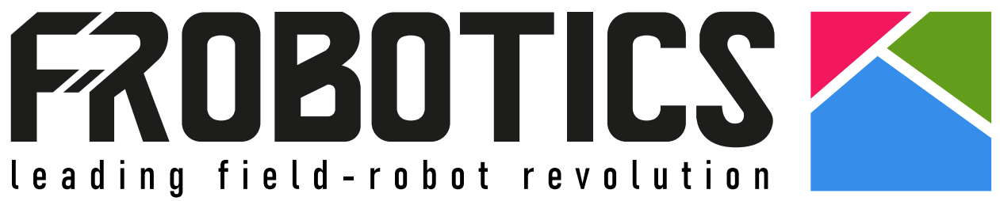

<div class="header-container" style="
  width: 100%;
  display: flex;
  justify-content: space-between;
  align-items: center;
  margin-top: 10px;
  margin-bottom: 20px;
">

  <!-- LOGO A SINISTRA -->
  <div style="flex: 0 0 auto;">
    
  </div>

  <!-- INFO AZIENDALI A DESTRA -->
  <div style="
    flex: 1;
    text-align: right;
    line-height: 1.35;
  ">
    <strong style="font-size: 20px;">Field Robotics S.R.L.</strong><br>
    <a href="https://www.fieldrobotics.it" style="color:#0057a0;">www.fieldrobotics.it</a><br>
    <a href="mailto:info@fieldrobotics.it" style="color:#0057a0;">info@fieldrobotics.it</a>
  </div>

</div>

<!-- BARRA NERA SENZA DOPPIE LINEE -->
<div style="
  width: 100%;
  height: 2px;
  background-color: #111;
  margin-bottom: 35px;
"></div>

# 1. Introduzione alle DJI Edge SDK (ESDK)

Documentazione ufficiale DJI:  
<https://developer.dji.com/doc/edge-sdk-tutorial/en/basic-intro/whats-esdk.html>

Nel nostro progetto di monitoraggio automatico e centralizzato, che utilizza una **DJI Dock 2** con drone **Matrice 3TD**, la gestione efficiente dello streaming video è un elemento chiave. Per questo motivo sono state valutate le **DJI Edge SDK (ESDK)**, un kit di sviluppo fornito da DJI che permette di acquisire ed elaborare lo streaming video direttamente in locale (edge computing), evitando il passaggio attraverso il cloud.


## Cosa sono le DJI Edge SDK?

Le DJI Edge SDK sono un insieme di strumenti di sviluppo che consentono di acquisire lo **streaming video del drone in locale**. Questo permette di implementare applicazioni avanzate basate sull’elaborazione delle immagini — come il riconoscimento di oggetti tramite AI — in modo molto più efficiente, grazie a una latenza estremamente ridotta rispetto allo streaming via cloud.

Poiché lo streaming avviene all’interno della rete locale, la qualità della connessione Internet non influisce sul sistema: è sufficiente che dock e server/PC si trovino sulla **stessa rete locale**.

Nel nostro caso, l’utilizzo dell’ESDK permette di ottenere uno streaming video significativamente più rapido e fluido, requisito essenziale per:
- monitoraggio in tempo reale,
- futura integrazione del **tracking dei camion**,
- supervisione dell’operatore con riscontro quasi immediato dell’inquadratura.

## Modelli Supportati

Le Edge SDK attualmente supportano:

- DJI Dock con Matrice 30/30T  
- **DJI Dock 2 con Matrice 3D/3TD**  
- DJI Dock 3 *(non specificato esplicitamente nella documentazione, ma appare tra i dispositivi elencati)*

---

# 2. Configurazione dell'Ambiente di Sviluppo

## Configurazione di Dock e Server nella Rete Locale

Per permettere la comunicazione tra la **DJI Dock** e il **server/PC di edge computing**, entrambi i dispositivi devono essere configurati con **indirizzi IP statici** all’interno della stessa rete locale.

Collega entrambi al medesimo router:
- **Dock:** tramite cavo Ethernet  
- **Server/PC:** tramite cavo o Wi-Fi


## Configurazione del Router

Configura la LAN del router come segue:

- **Network:** `192.168.200.0/24`

Assicurati che il DHCP **non assegni automaticamente** gli indirizzi dedicati alla dock e al server.


## Configurazione della DJI Dock

Tramite **DJI Pilot** (collegando il radiocomando alla dock via USB):

1. Accedi a **Network Configuration**  
2. Disattiva **Auto IP**  
3. Inserisci i valori statici:
   - **IP Dock:** `192.168.200.100` *(obbligatorio)*
   - **Subnet mask:** `255.255.255.0`
   - **Gateway / DNS:** opzionali (possono essere copiati da una configurazione automatica)
4. Salva la configurazione


## Configurazione del Server/PC di Edge Computing

Sul dispositivo Linux (es. **Ubuntu**), configura la scheda di rete con:

- **IP Edge:** `192.168.200.55`  
- **Subnet mask:** `255.255.255.0`


## Verifiche Rapide

Dal server/PC eseguire:

```bash
ping 192.168.200.100
```


<div style="
  width: 100%;
  margin-top: 50px;
  padding-top: 12px;
  border-top: 2px solid #000;
  text-align: center;
  font-size: 11px;
  color: #555;
  line-height: 1.4;
">
  <strong>Field Robotics S.R.L.</strong> — Report tecnico interno<br>
  Autore: Sebastiano Bertamè — Revisione: 0<br>
  <em>Documento riservato — Non distribuire</em>
</div>